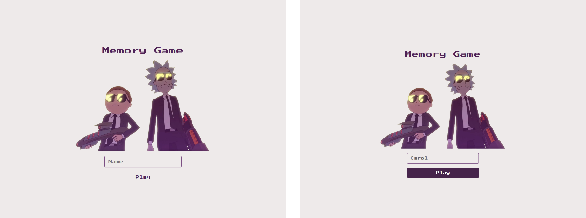
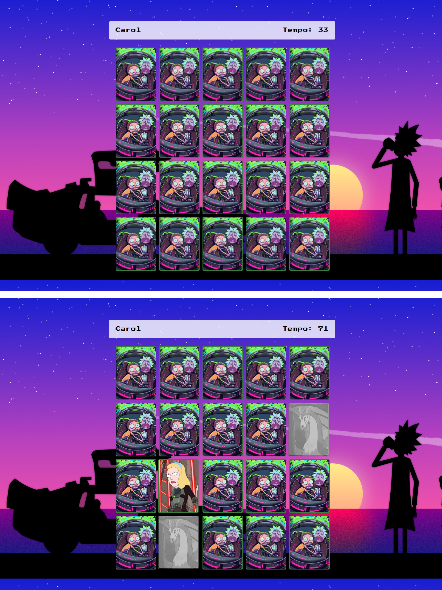

<h1 align="center">Memory Game</h1>

Jogo desenvolvido por meio de estudos. 
Criado com HTML, CSS e JS, realizando uma integração a uma API pública para coleta de imagens.
 

  <h2>🏠 Login</h2>
  

  <h2>🏠 Home </h2>
  

## 🚀 Tecnologias

Esse projeto foi desenvolvido com as seguintes tecnologias:

-  Figma
-  HTML
-  CSS
-  JavaScript
-  API pública
-  Git e Github

## 🖱 Página publicada

-  https://anacaasilva.github.io/Memory-Game/